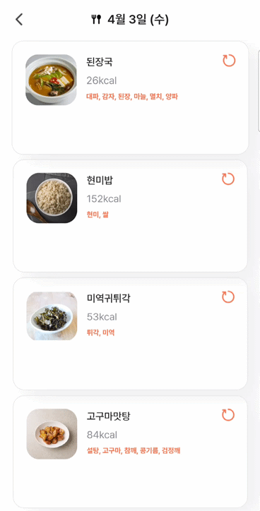

# IBalance - 우리 아이 맞춤형 식단 추천 서비스 

<div align="center">
    <br />
        
    <br />
</div>


## 목차
- [서비스 개요](#서비스-개요)
- [팀원소개](#팀원소개)
- [기술스택](#기술스택)
- [시스템 아키텍쳐](#시스템-아키텍쳐)
- [기능소개](#기능소개)
- [프로젝트 산출물](#프로젝트-산출물)


<br>

## 서비스 개요
```
빅데이터를 활용한 어린이 식단 추천 서비스 : 아이들에게 건강한 식단을 제공하고 싶은 부모님을 위한 개인 맞춤 식단 서비스 제공
```


## 팀원소개

<div align="middle">
<table>
    <tr>
        <td height="140px" align="center"> <a href="https://github.com/hyunjiihye?v=4">
             <br><br> ✨ 현지혜 <br>(Front-End) </a> <br></td>
        <td height="140px" align="center"> <a href="https://github.com/suehwanBoo">
             <br><br> 🌻 부수환 <br>(Front-End) </a> <br></td>
        <td height="140px" align="center"> <a href="https://github.com/whalesbob">
             <br><br> 🤿 남동우 <br>(Back-End) </a> <br></td>
        <td height="140px" align="center"> <a href="https://github.com/soungjin">
             <br><br> 🎮 박성진 <br>(Back-End) </a> <br></td>
        <td height="140px" align="center"> <a href="https://github.com/jjuyii49">
             <br><br> 🐈‍ 김주이 <br>(Back-End) </a> <br></td>
        <td height="140px" align="center"> <a href="https://github.com/kimhaechang1">
             <br><br> 🛌 김회창 <br>(Back-End) </a> <br></td>
    </tr>
</table>
</div>


## 기술스택


### 프론트앤드
<div align="middle">


<br>

**Language |** HTML5, CSS3, JavaScript, node.js(v20.10.0)

**Framework |** React.js(v18.2.0), Redux(v9.1.0), Vite(v5.1.4), 

**Library |** eslint(v8.56.0), vite PWA plugin(v9.19.7), prettier(v3.2.5), Lottie(v1.2.4), Axios(v1.6.7),Firebase(v10.10.0)


</div>

<br>
<br>

### 백앤드 

<div align="middle">

 


<br>

**Language |** Java 21

**Framework |** Spring Boot 3.2.3

**DB Connection(ORM) |** Spring Data JPA

**Build Tool |** Gradle 8.5.0

</div>
<br>
<br>

### 빅데이터

<div align="middle">


<br>

**Language |** Python 3.12

**Framework |** FastAPI 0.110.0

**Library |** Pandas 2.2.1 , Pydantic 2.6.3, Uvicorn 0.27.1, 

</div>


<br>


### 인프라

<div align="middle">


<br>

**DB |** MySQL 8.0.36, MongoDB 7.0.6

**Server |** GitLab, Jenkins, Docker, Nginx

</div>

<br>
<br>


### Development Tools 

<div align="middle">


</div>

<br><br>


## 시스템 아키텍쳐

<div align="middle">
  <br />
  
  <br />
</div>


## 기능소개

### 1. 실행 및 로그인

<table>
    <tr>
        <th>실행</th>
        <th>로그인</th>
    </tr>
    <tr>
        <td></td>
        <td></td>
    </tr>
</table>
<br>

### 2. 자녀정보 초기 생성

<table>
    <tr>
        <td>생성 & 이름</td>
        <td>생년월일</td>
        <td>성별</td>
    </tr>
    <tr>
        <td></td>
        <td></td>
        <td></td>
    </tr>
    <tr>
        <td>키</td>
        <td>몸무게</td>
        <td>알러지정보</td>
    </tr>
    <tr>
        <td></td>
        <td></td>
        <td></td>
    </tr>
</table>
<br>

### 3. 메인 & 정보삭제

<table>
    <tr>
        <td>초기메인페이지</td>
        <td>자녀정보삭제</td>
    </tr>
    <tr>
        <td></td>
        <td></td>
    </tr>
</table>
<br>

### 4. 식단추천

<table>
    <tr>
        <td>식단생성</td>
        <td>식단확인</td>
        <td>식사추가</td>
    </tr>
    <tr>
        <td></td>
        <td></td>
        <td></td>
    </tr>
    <tr>
        <td>메뉴상세</td>
        <td>메뉴교체</td>
        <td>메뉴교체불가상황</td>
    </tr>
    <tr>
        <td></td>
        <td></td>
        <td></td>
    </tr>
    <tr>
        <td>메뉴저장</td>
        <td>마이페이지 식단확인</td>
    </tr>
    <tr>
        <td></td>
        <td></td>
    </tr>
</table>
<br>

### 5. 식단일기

<table>
    <tr>
        <td>식단일기조회 - 식단없음</td>
        <td>식단일기조회 - 식단있음</td>
    </tr>
    <tr>
        <td></td>
        <td></td>
    </tr>
    <tr>
        <td>식단일기저장</td>
        <td>식단일기확인</td>
    </tr>
    <tr>
        <td></td>
        <td></td>
    </tr>
</table>
<br>

### 6. 편식해결 레시피

<table>
    <tr>
        <td>편식레시피조회 - 편식안할때</td>
        <td>편식레시피조회 - 편식할때</td>
    </tr>
    <tr>
        <td></td>
        <td></td>
    </tr>
    <tr>
        <td>편식레시피 - 무한스크롤</td>
        <td>편식레시피 - 레시피상세조회</td>
    </tr>
    <tr>
        <td></td>
        <td></td>
    </tr>
</table>
<br>


### 7. 아이정보 & 성장데이터

<table>
    <tr>
        <td>아이변경</td>
        <td>아이정보변경</td>
        <td>아이프로필사진저장</td>
    </tr>
    <tr>
        <td></td>
        <td></td>
        <td></td>
    </tr>
    <tr>
        <td>아이성장그래프 1</td>
        <td>아이성장그래프 2</td>
    </tr>
    <tr>
        <td></td>
        <td></td>
    </tr>
</table>
<br>

### 8. 앱 알림

<table>
    <tr>
        <td>백그라운드 - 리뷰요청</td>
        <td>백그라운드 - 식단확인</td>
        <td>백그라운드 - 업데이트</td>
    </tr>
    <tr>
        <td></td>
        <td></td>
        <td></td>
    </tr>
    <tr>
        <td>포어그라운드 - 리뷰요청</td>
        <td>포어그라운드 - 식단확인</td>
        <td>포어그라운드 - 업데이트</td>
    </tr>
    <tr>
        <td></td>
        <td></td>
        <td></td>
    </tr>

</table>


## 프로젝트 산출물

- API 명세서


- ERD Schema


- 와이어프레임


- Convention


- Porting Manual


- Reference